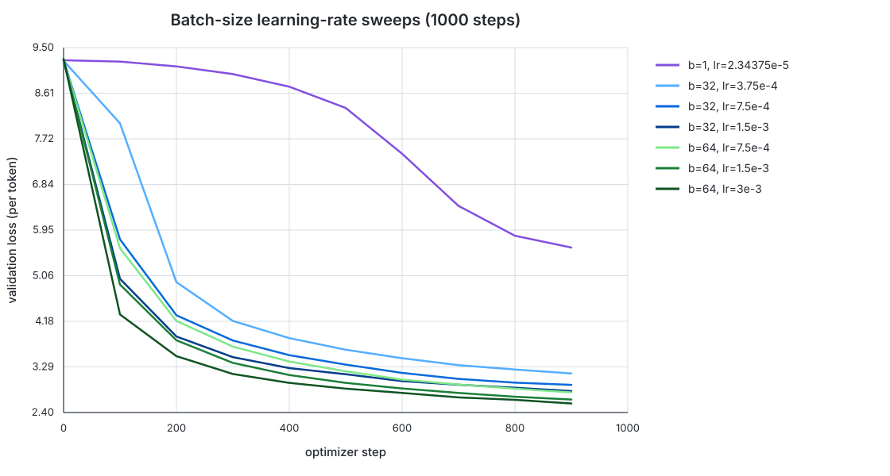
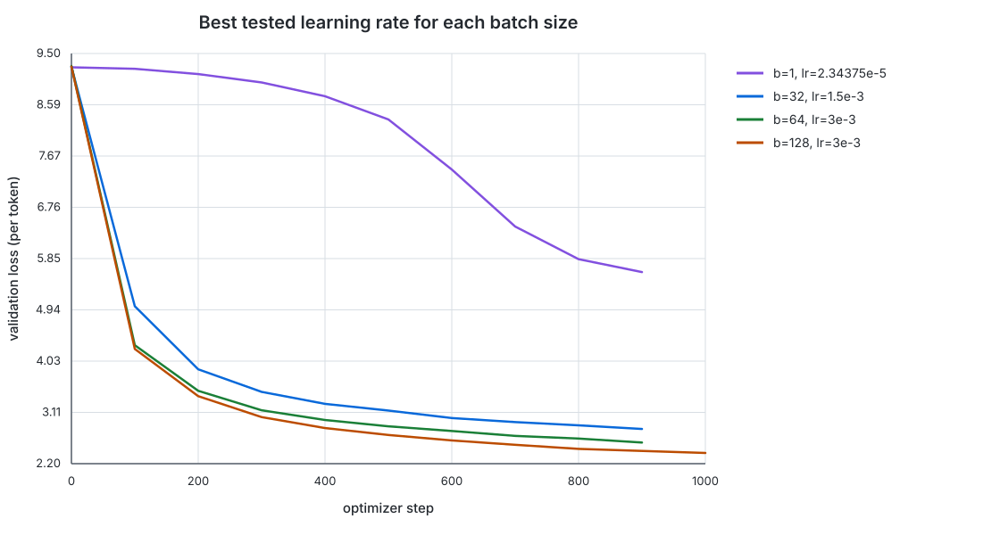

# Batch-size experiments on TinyStories

## Experimental setup

The best learning rate from the batch-128 sweep was `L* = 3e-3`. I used it to
construct batch-dependent learning-rate candidates, while leaving the model,
500-step warmup, 10,000-step cosine schedule, and all other optimizer settings
unchanged. Every new batch-size run used 1,000 optimizer steps and
`min_lr = 0.1 * lr`.

| Batch size | Tested peak learning rates |
|---:|---|
| 1 | `2.34375e-5` (`L*/128`) |
| 32 | `3.75e-4`, `7.5e-4`, `1.5e-3` |
| 64 | `7.5e-4`, `1.5e-3`, `3e-3` |
| 128 | Reused the existing `3e-3` curve |

For batch 32, the candidates surround the linearly scaled reference
`L*/4 = 7.5e-4`. For batch 64, they surround `L*/2 = 1.5e-3`. Batch 1 was
included to cover the lower endpoint requested in the assignment, while the
three-rate searches were run for batches 32 and 64 as requested.

## Results

The tail mean below averages the five evaluations at steps 500, 600, 700, 800,
and 900.

| Batch | Peak LR | Step-900 val loss | Tail-5 mean | Average step time |
|---:|---:|---:|---:|---:|
| 1 | `2.34375e-5` | 5.6097 | 6.7261 | 0.040 s |
| 32 | `3.75e-4` | 3.1603 | 3.3595 | 0.147 s |
| 32 | `7.5e-4` | 2.9386 | 3.0956 | 0.147 s |
| 32 | `1.5e-3` | **2.8176** | **2.9594** | 0.147 s |
| 64 | `7.5e-4` | 2.7923 | 2.9688 | 0.289 s |
| 64 | `1.5e-3` | 2.6533 | 2.7974 | 0.289 s |
| 64 | `3e-3` | **2.5760** | **2.7127** | 0.289 s |

For a direct update-count comparison, the best tested configuration at each
batch size is:

| Batch | Best tested peak LR | Step-900 val loss | Mean, steps 500--900 |
|---:|---:|---:|---:|
| 1 | `2.34375e-5` | 5.6097 | 6.7261 |
| 32 | `1.5e-3` | 2.8176 | 2.9594 |
| 64 | `3e-3` | 2.5760 | 2.7127 |
| 128 | `3e-3` | **2.4267** | **2.5499** |

## Findings

At a fixed number of optimizer updates, larger batches reached lower
validation loss. This comparison is not token-budget matched: batch 128 sees
128 times as many training tokens per update as batch 1, so part of its
advantage is simply greater data exposure. Wall-clock time per update also
increased with batch size, from roughly 0.040 seconds at batch 1 to 0.289
seconds at batch 64 and 1.334 seconds for the batch-128 screening run.

The preferred learning rate increased with batch size. Within the tested
ranges, batch 32 preferred `1.5e-3`, while batch 64 preferred `3e-3`. Both are
the highest rates tested for their batch, so the true optima may lie above
these search ranges; the result should be read as "best tested" rather than as
a fully bracketed optimum.

The batch-1 run learned much more slowly. Besides processing far fewer tokens,
it spent half of the 1,000-step budget in warmup, and the linearly scaled
learning rate remained very small. This makes the batch-1 result a useful
endpoint demonstration, but not a claim that the rate is independently
optimal for batch 1.

## Artifacts

- Validation curves: [`data/`](data/)
- Figures: [`assets/`](assets/)
- Logs: `experiment_logs/overnight_batch*_s1000.log`
- Checkpoints: `checkpoints/overnight_batch*_s1000/final.ckpt`

