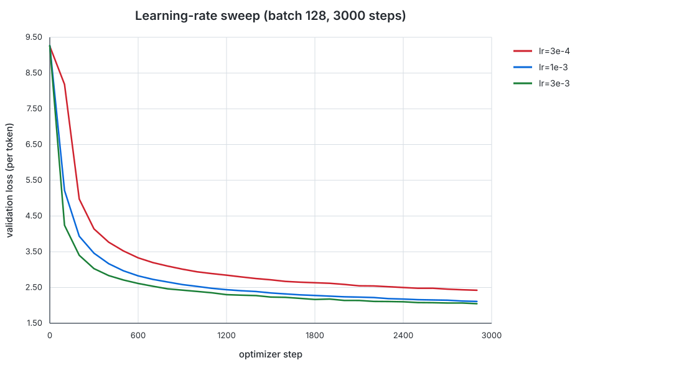
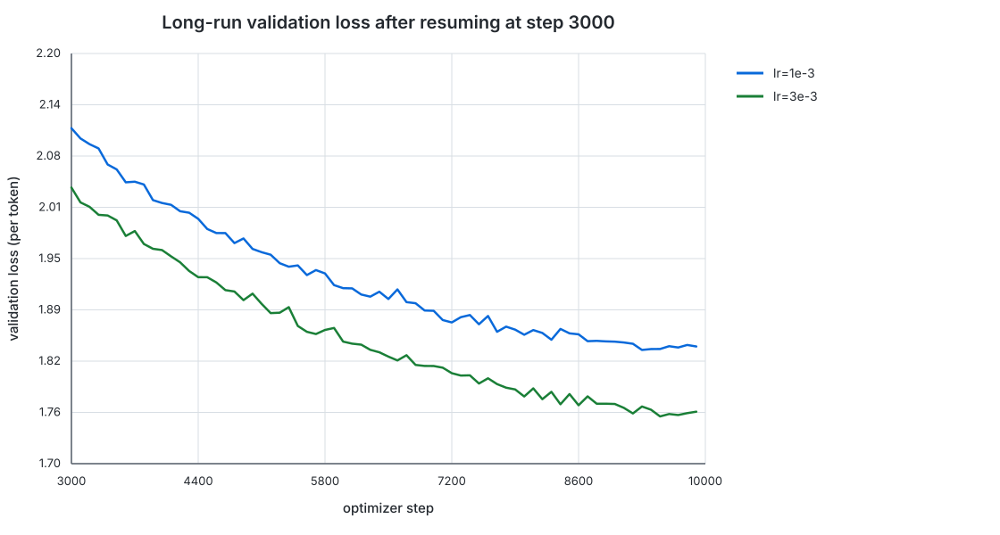

# Learning-rate sweep on TinyStories

## Experimental setup

All experiments used the existing `TransformerLM` implementation and the
TinyStories train/validation arrays. The baseline command was:

```text
python3 tests/trainer.py data/tiny_story_train.npy data/tiny_story_val.npy \
  --exp_name tiny_1e-3 \
  --config_path tests/exp_config/config_1e-3.yaml
```

The sweep changed only the peak learning rate and set
`min_lr = 0.1 * lr`. All other requested settings were held fixed:

| Setting | Value |
|---|---:|
| Batch size | 128 |
| Warmup steps | 500 |
| Cosine-decay steps | 10,000 |
| Screening steps | 3,000 |
| Validation interval | 100 steps |
| Validation batches per evaluation | 50 |

The search bracketed the `1e-3` baseline with one lower rate (`3e-4`) and one
higher rate (`3e-3`). I ranked configurations using the mean of the last five
validation evaluations (steps 2500--2900), rather than a single noisy final
evaluation.

## 3,000-step sweep

| Peak LR | Min LR | Step-2900 val loss | Mean val loss, steps 2500--2900 | Outcome |
|---:|---:|---:|---:|---|
| `3e-4` | `3e-5` | 2.4236 | 2.4549 | Stable, but slow |
| `1e-3` | `1e-4` | 2.1113 | 2.1382 | Stable |
| `3e-3` | `3e-4` | **2.0475** | **2.0670** | Stable; selected |



None of the tested learning rates diverged. The higher `3e-3` rate reduced
validation loss fastest and had the best final and tail-mean losses, so it was
selected for the long run.

## 10,000-step runs

The `3e-3` run resumed successfully from its 3,000-step checkpoint and
continued through step 9,999. Because its validation loss remained above the
required 1.45, I also resumed the runner-up `1e-3` configuration as a
cross-check.

| Peak LR | Resume step | Step-9900 val loss | Mean val loss, steps 9500--9900 | Average resumed-run step time |
|---:|---:|---:|---:|---:|
| `1e-3` | 3,000 | 1.8429 | 1.8424 | 1.306 s |
| `3e-3` | 3,000 | **1.7634** | **1.7605** | 1.221 s |



The curves remain stable, and `3e-3` retains a clear advantage at 10,000
steps. The best checkpoint from this constrained sweep is:

```text
checkpoints/overnight_lr_b128_3e-3_s10000_resume/final.ckpt
```

However, its measured per-token validation loss is about 1.76, so the
assignment target of at most 1.45 was **not met** by these runs. The requested
fallback to a fresh 10,000-step run was not needed because checkpoint restore
worked correctly.

## Interpretation and limitations

Within the tested interval, validation loss improved monotonically as the
learning rate increased from `3e-4` to `3e-3`. Therefore, this sweep identifies
the best tested rate, but it does not prove that the optimum was bracketed.
Testing a somewhat higher rate would be the natural next diagnostic if the
experiment constraints were relaxed.

These are single-run comparisons. The current trainer does not apply the
`random_seed` field to NumPy or PyTorch, so the experiment does not provide
replicate-based uncertainty estimates. All new W&B runs were kept in offline
mode; no experiment data was uploaded.

## Artifacts

- Validation curves: [`data/`](data/)
- Sweep ranking: [`../experiment_state/learning_rate_scores.tsv`](../experiment_state/learning_rate_scores.tsv)
- Screening checkpoints:
  `checkpoints/overnight_lr_b128_{3e-4,3e-3}_s3000/`
- Long-run checkpoints:
  `checkpoints/overnight_lr_b128_{1e-3,3e-3}_s10000_resume/`

